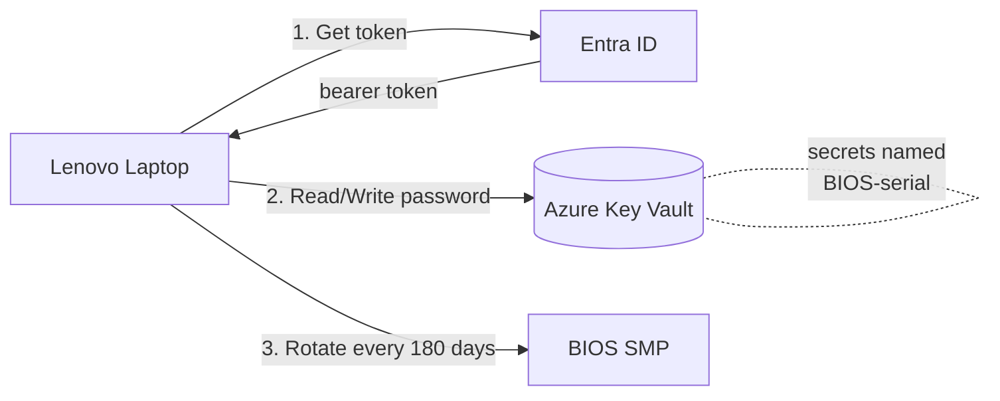
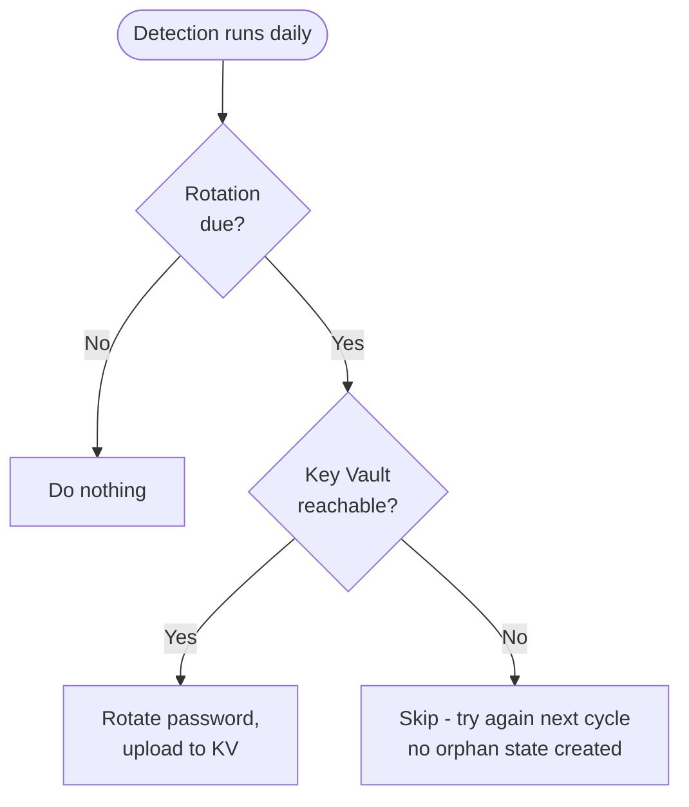
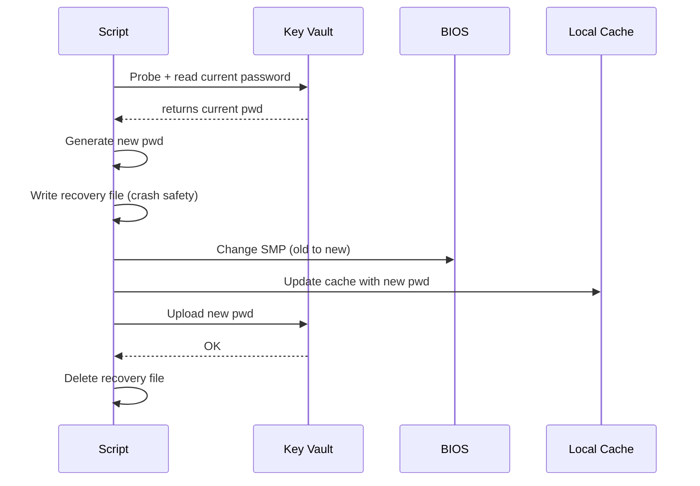
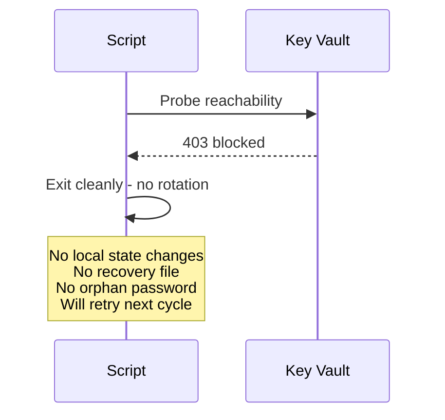
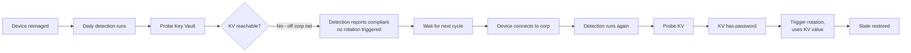
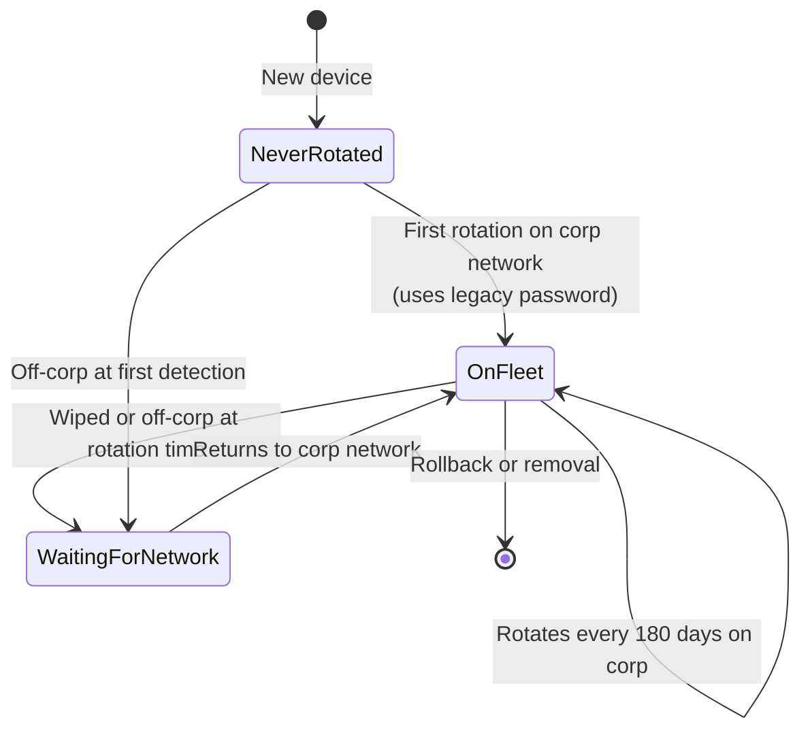
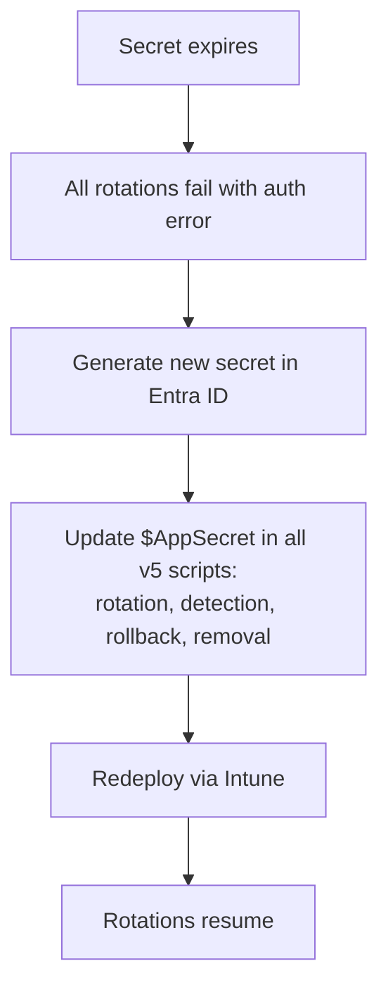

# KB: Lenovo BIOS Password Management

**KB Number:** KBKB-NUMBER
**Category:** Endpoint Security / BIOS Management
**Audience:** IT Operations, Service Desk, Endpoint Engineering
**Last Updated:** 2026-05-13
**Version:** 3.0 

---

## What Is This?

Every Lenovo laptop in our fleet has a unique BIOS System Management Password (SMP). Passwords are generated automatically, rotated every 180 days, and stored in Azure Key Vault. No two devices share the same password.

The system runs through Microsoft Intune with no manual effort required. Passwords are accessible to authorised staff via the Azure portal.

**v5 design rule:** Rotation only happens when Key Vault is reachable. If a device is off the corporate network, the script will skip and try again next cycle. This prevents firmware-level lockouts from wrong-password attempts.

---

## System at a Glance



---

## How Do I Look Up a Device's BIOS Password?

You need access to the Azure Key Vault named **your-keyvault-name**.

### Via Azure Portal

1. Go to **portal.azure.com**
2. Navigate to **Key Vaults** > **your-keyvault-name**
3. Click **Secrets** in the left menu
4. Search for `BIOS-<SerialNumber>` (e.g., `BIOS-PC0K1234`)
5. Click the secret > click the current version > click **Show Secret Value**

### Via PowerShell

```powershell
$Token = (Invoke-RestMethod -Method POST `
    -Uri "https://login.microsoftonline.com/your-tenant-id/oauth2/v2.0/token" `
    -Body @{
        client_id     = "your-app-id"
        scope         = "https://vault.azure.net/.default"
        client_secret = "your-app-secret"
        grant_type    = "client_credentials"
    } -UseBasicParsing).access_token

$Secret = Invoke-RestMethod -Method GET `
    -Uri "https://your-keyvault-name.vault.azure.net/secrets/BIOS-PC0K1234?api-version=7.4" `
    -Headers @{ Authorization = "Bearer $Token" } -UseBasicParsing

$Secret.value
```

### Finding the Serial Number

- On the device: `wmic bios get serialnumber`
- In Intune: Devices > search > Hardware > Serial number
- On the physical device: bottom sticker

---

## How Does Rotation Work?



### Online Flow (Corporate Network)



### Offline / Off-Corp Flow



---

## Common Scenarios

### Technician Needs BIOS Access

1. Get device serial number
2. Look up `BIOS-<serial>` in Key Vault
3. Use at the BIOS prompt
4. **Important:** do not attempt the OLD shared password -- repeated wrong attempts at BIOS can cause firmware retry lockouts.

### "Access Denied" at BIOS

The device has an SMP set. Look up the current password in Key Vault. Do not guess.

### Lockout from Repeated Wrong Attempts

If a user enters the wrong BIOS password too many times at the BIOS prompt, F12 boot menu, or BIOS Setup screen, Lenovo firmware temporarily locks the device. **This is enforced by the BIOS hardware itself, not by Windows. Windows cannot see or log these attempts.**

**Recovery:**
1. Full shutdown (hold power button, not restart) for 5-10 minutes
2. If still locked, leave off for 30+ minutes
3. If still locked, contact Lenovo Service Desk with serial + proof of ownership

### Rotation Script Failed

Check `C:\Windows\Debug\BIOS_Password_YYYYMMDD.log` on the device.

| Log Message | Meaning | Action |
|---|---|---|
| `KV unreachable - rotation deferred (will retry next run)` | Off corp network | Normal. Will rotate when next on corp. |
| `Pending recovery uploaded to KV` | Previous run crashed mid-rotation, this run drained it | Self-healed. |
| `KV read 'BIOS-XXX': secret does not exist (first run for this device)` | New device, first rotation | Normal, uses legacy password fallback. |
| `Cannot resolve current password` | No KV record AND no legacy configured | Device reimaged? Verify KV state. |
| `BIOS change failed: ... Access Denied` | Wrong password used | Cache/KV out of sync OR wrong legacy password. |
| `Not a Lenovo device` | Script ran on non-Lenovo hardware | Check Intune assignment targeting. |

### Reimaged Device, Off Corp Network



**Key point:** v5 detection holds rotation until KV is reachable. This prevents the firmware lockout that v4 could cause on wiped devices.

### Fleet Rollback


### DaaS Device Return


### Device Disk Corrupted, Password Unknown

1. Check Key Vault for `BIOS-<serial>` - latest version should match the BIOS
2. If KV password doesn't work, contact Lenovo Service Desk with proof of ownership

---

## Files on Each Device (v5)

| File | Location | Purpose |
|---|---|---|
| BIOS_Current.dat | C:\Windows\Debug\ | Encrypted current password (DPAPI, SYSTEM only) - informational |
| BIOS_Recovery.dat | C:\Windows\Debug\ | Transient. Only exists during a rotation crash recovery window |
| BIOS_LastRun.marker | C:\Windows\Debug\ | Last rotation timestamp |
| BIOS_Password_*.log | C:\Windows\Debug\ | Daily rotation log |

Note: v5 does not create `BIOS_KVSync.ps1` or `BIOS_KVSync_*.log`. Those were v4 sync task artifacts and are no longer used. If you see them on a device, they are leftovers from v4 and will self-clean after their final upload.

---

## Device Lifecycle States (v5)



---

## Azure Components

| Component | Name | Purpose |
|---|---|---|
| Key Vault | your-keyvault-name | Stores per-device BIOS passwords |
| App Registration | your-app-registration-name | Identity used by scripts |
| Subscription | your-subscription | Hosts the Key Vault |

### Key Vault Access

- IP-restricted to corporate IPs
- **Key Vault Secrets Officer** or **Key Vault Secrets User** role required
- Request access via your-access-request-process

### App Registration Secret

Client secret expires on **expiry-date**. When it expires:



---

## Maintenance Tasks

| Task | Frequency | How |
|---|---|---|
| Rotate App Registration secret | Every 6 months | Entra ID > App Reg > new secret > update scripts > redeploy |
| Check Intune remediation compliance | Monthly | Intune > Remediations |
| Review Key Vault access logs | Monthly | Key Vault > Diagnostic settings |
| Test rollback on pilot device | Annually | Manual test, verify, re-rotate |
| Verify firewall rules | After network changes | Run Test-KeyVaultAccess.ps1 from affected networks |

---

## Escalation Path

| Issue | First Responder | Escalation |
|---|---|---|
| Single device BIOS access | Service Desk (look up in KV) | - |
| Rotation failures across fleet | Endpoint Engineering | Security Team |
| App secret expired | Endpoint Engineering | - |
| Key Vault access issues | Endpoint Engineering | Cloud Team |
| Device with unknown password + dead disk | Service Desk | Lenovo Service Desk |
| Firmware retry lockout | Service Desk | Lenovo Service Desk (after power-cycle attempt) |
| Security incident (credential leak) | Security Team | Rotate app secret immediately |

---

## FAQ

**Q: Can a standard user see or change the BIOS password?**
No. The script runs as SYSTEM. Local files are encrypted and ACL-locked to SYSTEM.

**Q: What happens if a laptop is offline for months?**
Detection holds. No rotation attempts are made until the device is back on corporate network. When it reconnects, the next detection triggers rotation.

**Q: Does every device get a different password?**
Yes. Each device generates its own 16-character random password. Stored in Key Vault under the device serial number.

**Q: Can I retrieve a previous password?**
Yes. Key Vault keeps all versions. Go to the secret > Versions > pick the one you need.

**Q: How much does this cost?**
Less than $1/year for 2300 devices. Key Vault charges $0.03 per 10,000 operations. Secret storage and versioning are free.

**Q: Does the script require PowerShell modules?**
No. It uses native REST calls only. No NuGet, no PSGallery, no Az modules.

**Q: Can I test Key Vault access from a specific network?**
Yes. Run Test-KeyVaultAccess.ps1 on any machine. It tells you if that network can reach the vault and which IP is being blocked if not.

**Q: What if a user reports a BIOS lockout?**
First, check `BIOS_Password_*.log` on the device. If the script logs show only successful rotations and no failed attempts, the lockout was caused by failed attempts made at the BIOS prompt itself (pre-boot) - these are not logged by Windows. Most common cause: someone tried the old password at F12 / BIOS Setup. Recovery: power cycle, wait 30 min, retry. If still locked, Lenovo Service Desk.

**Q: How is v5 different from v4?**
v5 will not rotate when Key Vault is unreachable. v4 allowed offline rotation with a background sync task. v5 eliminates the orphan-state risk and the firmware-lockout risk that occurred on wiped devices.

**Q: Will v4 sync tasks left over on existing devices still work?**
Yes. The v4 sync script is self-contained and uses pure REST. It will drain pending uploads when the device returns to corporate network, then self-delete. No conflict with v5.
