# Script Flow Reference: BIOS Password Management (v5)

**Version:** 3.0
**Date:** 2026-05-13

---

## High-Level Architecture

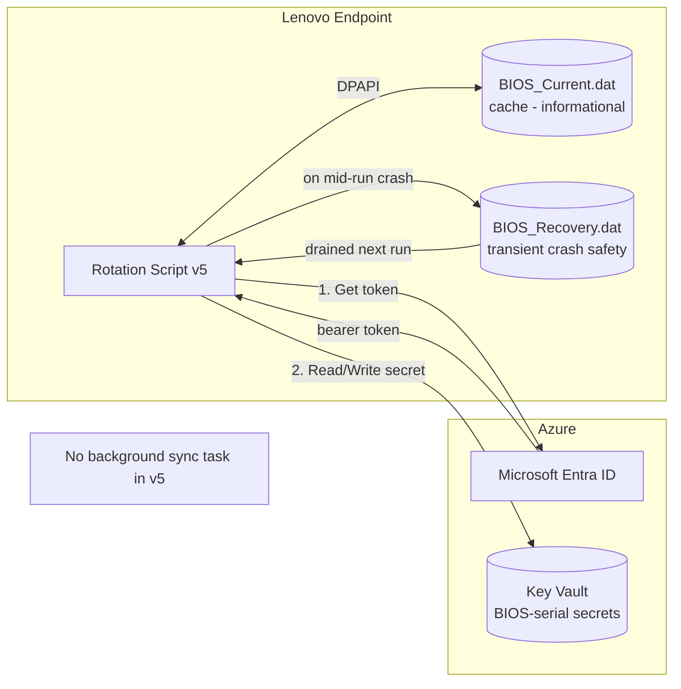

---

## Script 1: Set-LenovoBIOSPassword.ps1

### Purpose

Rotates the BIOS System Management Password (SMP) to a unique cryptographic value per device. Stores in Azure Key Vault. **Requires Key Vault reachability.** Refuses to rotate when KV is unreachable.

### Top-Level Flow

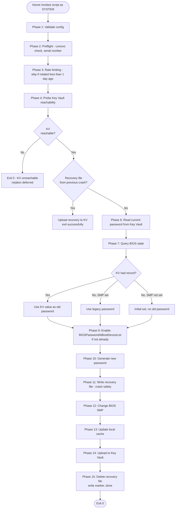

### Phase Details

| Phase | Purpose | What It Does |
|---|---|---|
| 1 | Validate config | Fail fast if `$TenantID`, `$AppID`, `$AppSecret`, `$VaultName` are placeholders |
| 2 | Preflight | Confirm Lenovo, get serial, build secret name `BIOS-<serial>` |
| 3 | Rate limiting | Skip if `BIOS_LastRun.marker` is less than 1 day old |
| 4 | **KV reachability -- HARD GATE** | Get token, attempt authenticated list. **If 403/network failure, exit 0 without rotating.** |
| 5 | Drain recovery | If a previous run crashed mid-rotation, upload that recovery file's password and exit |
| 6 | Read KV | Pull current password for this device |
| 7 | BIOS state | Query `Lenovo_BiosPasswordSettings.PasswordState` |
| 8 | Resolve old password | KV value > legacy fallback (only if SMP set and KV had no record) |
| 9 | BIOS setting | Enable `BIOSPasswordAtBootDeviceList` if not already enabled |
| 10 | Generate password | 16-char cryptographic random |
| 11 | Write recovery file | Crash-safety net before BIOS change |
| 12 | Change SMP | Use 2020+ `Lenovo_WmiOpcodeInterface` flow |
| 13 | Update cache | Informational only - used by detection |
| 14 | Upload to KV | Always attempted (KV verified reachable in Phase 4) |
| 15 | Finalize | Delete recovery file, update marker, exit |

### Decision Tree: Should We Rotate?

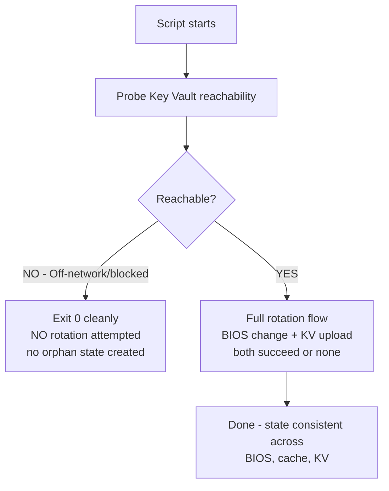

### Password Source Resolution (v5 simplified)

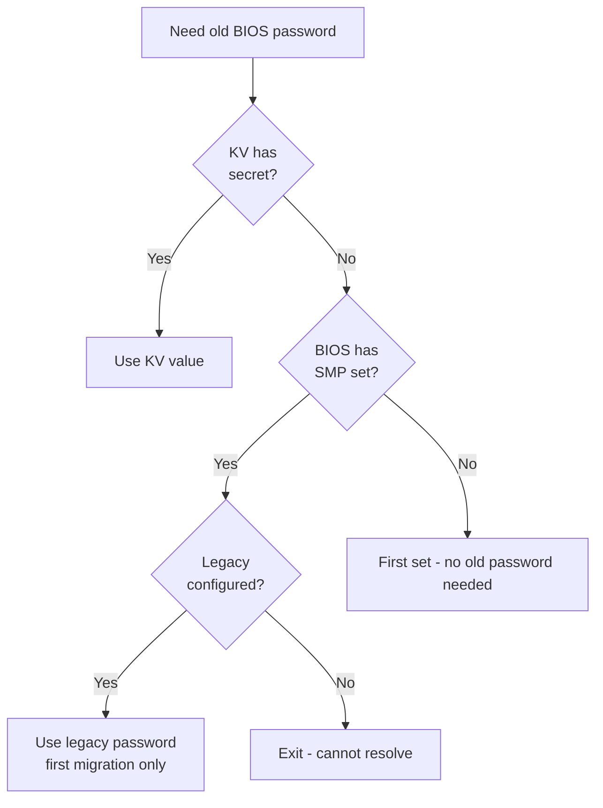

Note: v5 does NOT use the local cache as a password source. Cache is informational only.

### State File Lifecycle (within a single successful run)

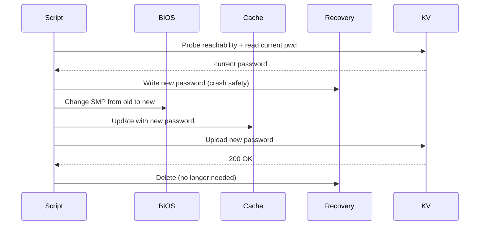

### Crash Recovery Within Same Day

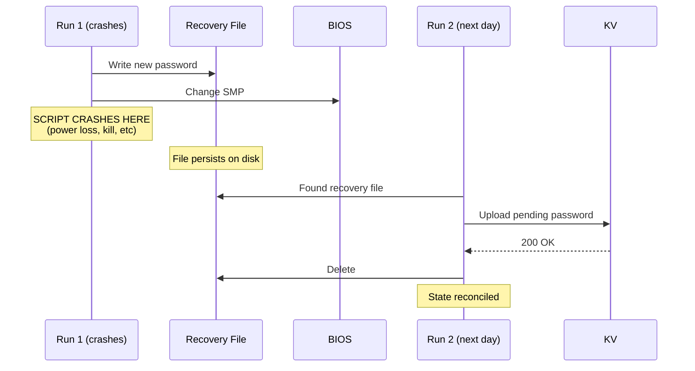

---

## Script 2: Detect-BIOSRotationDue.ps1

### Purpose

Intune Remediation detection script. Determines whether rotation should run. Includes KV verification on state-loss scenarios to prevent firmware lockouts.

### Flow

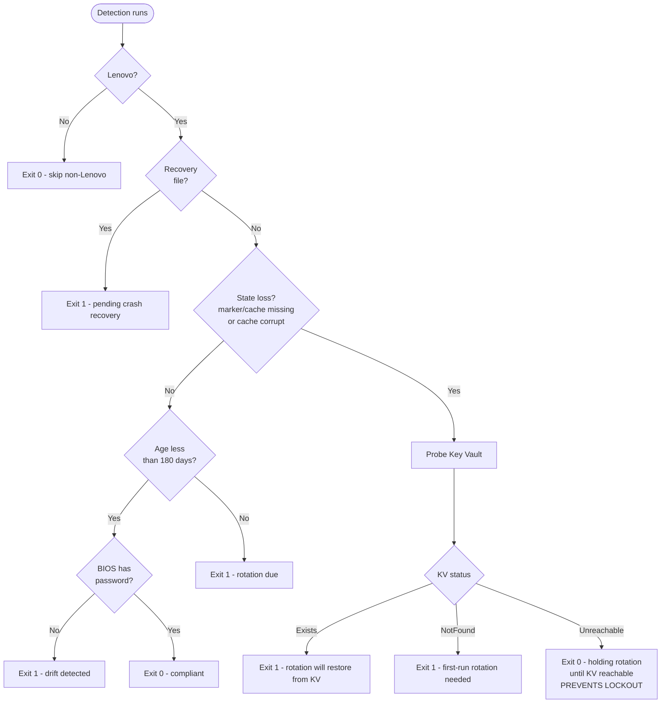

### Key Safety: State-Loss + KV-Unreachable Path

This is the critical addition in v5. When local state is missing (reimage, disk failure, wipe, manual deletion) AND Key Vault is unreachable, detection returns **compliant** rather than triggering rotation.

**Why this matters:**
- v4 behavior: Trigger rotation. Rotation tries legacy password. Legacy is wrong on a previously-rotated device. BIOS rejects. Repeats daily. Firmware lockout.
- v5 behavior: Wait until KV is reachable. Then trigger rotation, which uses the KV value. No wrong-password attempts ever.

### Exit Codes

| Exit | Meaning | Action |
|---|---|---|
| 0 | Compliant or N/A | No remediation runs |
| 1 | Non-compliant | Rotation script runs |

---

## Script 3: Rollback-BIOSToSharedPassword.ps1

### Purpose

Reverts devices to the shared password. Used for project rollback.

**Requires Key Vault reachability** -- refuses to run if KV is unreachable.

### Flow

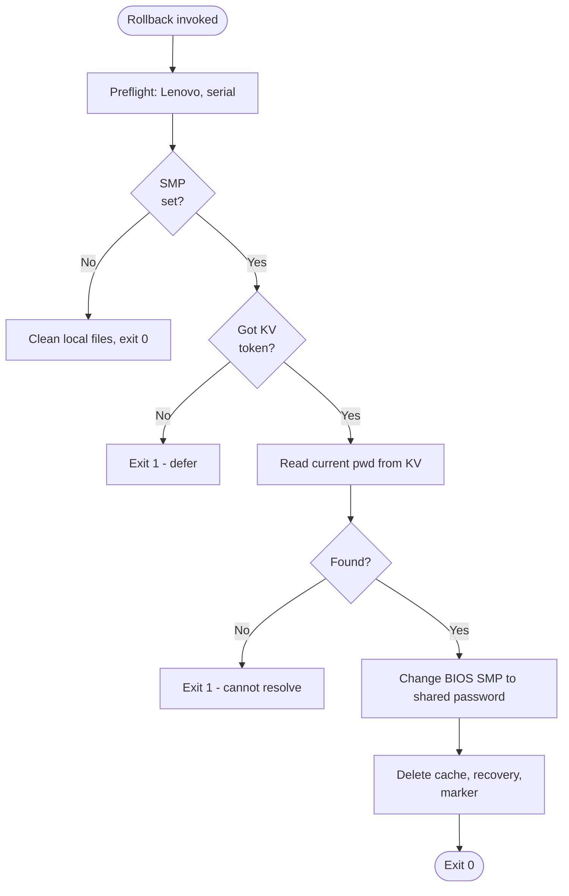

---

## Script 4: Remove-BIOSPassword.ps1

### Purpose

Removes BIOS password entirely. Used when returning DaaS devices.

**Requires Key Vault reachability.**

### Flow

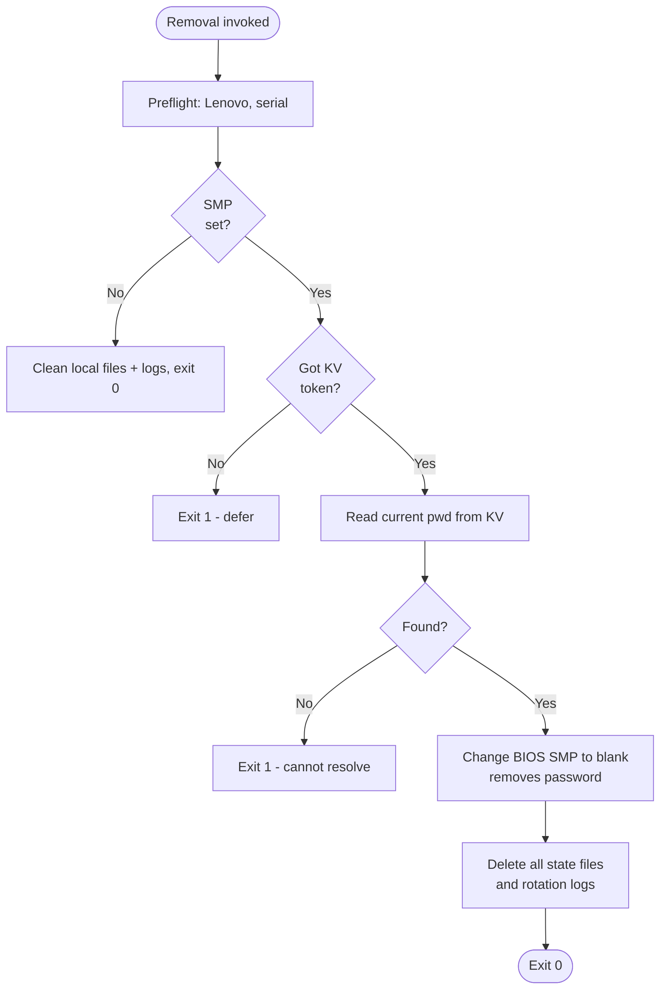

---

## Script 5: Test-KeyVaultAccess.ps1

### Purpose

Diagnostic tool to verify Key Vault access from any network. Read-only, no admin rights.

### Flow

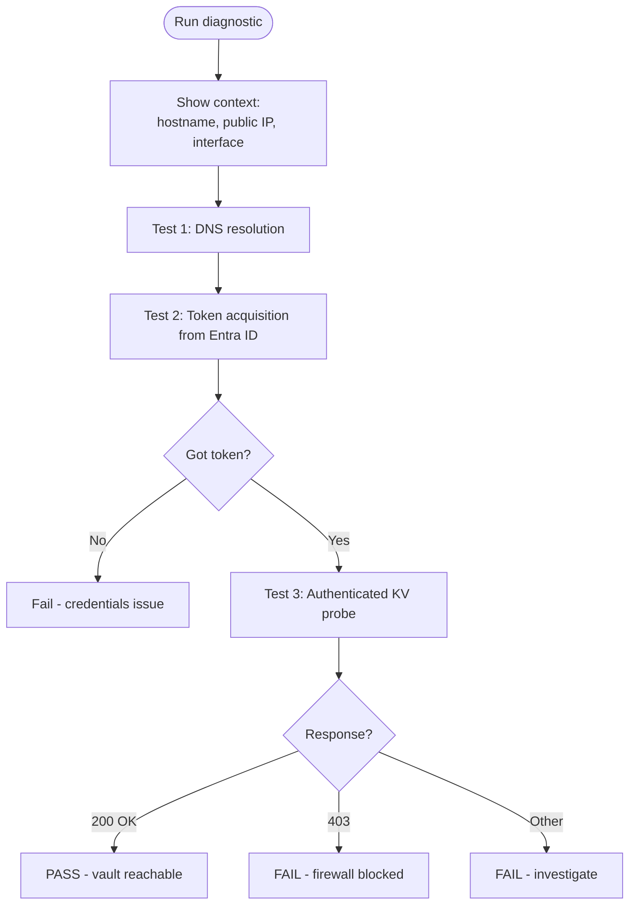

Note: Unauthenticated probes are unreliable. Key Vault returns 401 for anonymous requests regardless of firewall. Only authenticated probes reveal true firewall state.

---

## Script 6: Check-KeyVaultSecrets.ps1

### Purpose

Bulk-check the existence of secrets in Key Vault from a CSV of device names. Useful for fleet audits.

### Flow

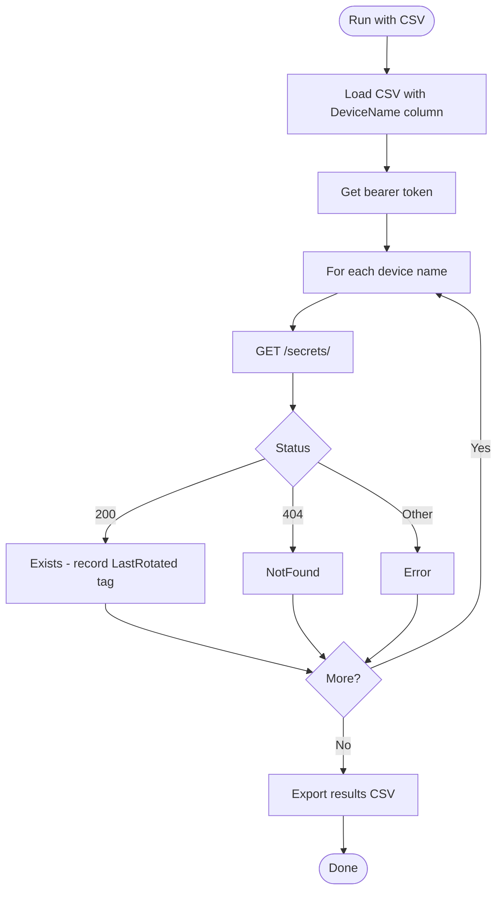

---

## Password Source Priority (All Scripts)

```
Priority 1:  Key Vault           Canonical source when reachable
Priority 2:  Recovery file       Crash-recovery within same script run
Priority 3:  Legacy password     Pre-migration fallback (first run only)
```

The local cache is NOT a password source for rotation. It's informational, used by the detection script for consistency checks.

---

## Exit Codes (All Scripts)

| Code | Meaning |
|---|---|
| 0 | Success, intentionally skipped, or deferred (waiting for KV) |
| 1 | Error (config missing, BIOS change failed, cannot resolve password) |
| 2 | Partial success (BIOS rotated but KV upload failed - rare crash window) |

---

## Intune Deployment Topology

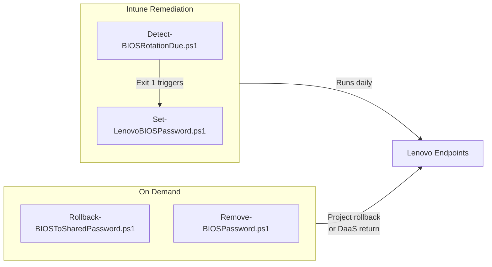

All deployments run as **SYSTEM** in **64-bit PowerShell**.

---

## What Changed from v4

| Aspect | v4 | v5 |
|---|---|---|
| Offline rotation | Allowed (uses local cache fallback) | **Refused** (KV reachable required) |
| Background sync task | BIOS-KV-Sync runs every 15 min | **Removed entirely** |
| Cache as password source | Used as fallback | Informational only |
| Detection on state loss | Always triggers rotation | Verifies KV first; holds if unreachable |
| Recovery file lifetime | Could persist for hours/days awaiting sync task | Only within a single run (seconds) |
| Risk: orphan rotation | Possible (offline rotation, then disk wipe) | Eliminated |
| Risk: firmware lockout from wrong-password retries | Possible (wiped device, no KV access) | Prevented by detection guard |
